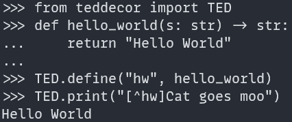
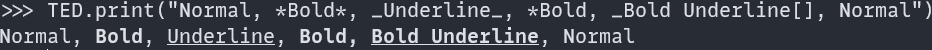

# TEDDecor
This is a easy to use library with testing, documentation, and docstring example code tools. Dive in with minimal effort and get great results. 


[TEDDecor](#teddecor)
  - [Testing](#testing)

## Testing

With testing, it is as simple as importing the `UnitTest` module, `from teddecor.UnitTest import *` or `from teddecor import UnitTest`, then building a test class with test cases (functions).

Below are a few generic levels of testing which can be mixed together however you want.

1. Use the provided `runTest` function to run a single method with the `@test` decorator
    ```python
    from teddecor.UnitTest import *
    
    @test
    def test_case():
        assert True

    if __name__ == "__main__":
        runTest(test_case)
    ```

2. Use the provided `Test` class to group test cases (functions) with the `@test` decorator.
   * This meant to group test that are focuses on a specific functionality
    ```python
    from teddecor.UnitTest import *
    
    class TestClass(Test):
        @test
        def test_case(self):
            assert True

    if __name__ == "__main__":
        TestClass().run()
    ```

3. Use the provided `TestSuite` class to group test classes and test cases together
   * This is meant to group a more general idea. Like the tests for a app can be split into backend and front end. Where both backend and frontend are their own test suite. Then inside the suites you get more focuses.
    ```python
    from teddecor.UnitTest import *
    
    class BackendInput(Test):
        @test
        def user_input(self):
            assert True
        
        @test
        def file_input(self):
            assert True

    @test
    def app_response():
        raise NotImplementedError

    if __name__ == "__main__":
        TestSuite(
            name="Backend"
            tests=[
                BackendInput,
                app_response,
            ]
        ).run()
    ```

   *  As you can see in the above example, you can use `raise NotImplementedError` to skip a test which also gives the message of `Not Implemented`

4. Use provided `Asserts` and `AssertThat` modules to add readable, easy to use, testing assertions.
   ```python
    from teddecor.UnitTest import *

    @test
    def assert_that():
        assertThat(12, eq(12))
        # Reads as, assert that 12 is equal to 12
        assertThat("the", within(["the", "moon"]))
        # Reads as, assert that "the" is within ["the", "moon"]
        assertThat("the moon", has("moon"))
        # Reads as, assert that "the moon" has "moon"

    @test
    def base_asserts():
        Asserts.assert_equals(12, 12)
   ```
   * Read the documentation for the `Asserts` and `AssertThat` modules for more information along with how you can create your own functions for assertThat
   
Below is an example test (`example.py`)

```python
from teddecor.UnitTest import *

class Example(Test):
  @test
  def test_pass(self):
    assert True

if __name__ == "__main__":
  Example().main()
```

The above example shows that you need to have a class that inherits from `UnitTest.Test`. Then when you run the `main()` function from an instance of that class,
you get the results printed out. The `main()` function will run any method in the class that has the `@test` decorator.

> NOTE:
> You can not use the keyword `totals` as a function name by itself inside of test suites and classes

**Results:**

<p align="center">
  
</p>

Since this package is used to test itself, feel free to look through the files in the repo's `tests/` folder to see **examples** and **outputs** of testing.

<p align="center" style="bold">
  To see more testing features like, mocking, setup, result save file types, etc... see the <a href="https://tired-fox.github.io/TEDDecor/teddecor.html" title="Docs" target="_blank">documentation</a>.
<p>

___

## TED markup

TED is the name for the inline markup language for this library. This allows the user to customize strings and prettyprint different information to stdout.

Includes:

* parse -> returns formatted strings
* pprint -> parse TED markup strings and display them to stdout
* More to come...

Syntax:

Brackets `[]` indicate a macro. Macros can do 1 of three things; Assign a foreground/background color,
create a hyperlink, and call a builtin function. All macros will ignore extra whitespace and focus on the identifiers; `@`, `~`, and `^`.

1. Colors
    * Colors start with a leading identifier `@`. To indicate foreground or background use the specifier `F` and `B` respectively.
    Following the `@` and the specifier you can then enter the color. 
        * This can be a predifined color such as; black, red, green, yellow, blue, magenta, cyan, white. `[@F black]`.
        * It can be a hex code `#ead1a8`. `[@F #ead1a8]`.
        * It can be a XTerm code 0-256. `[@F 9]`.
        * Lastely, it can be an rgb color where the 3 numbers can be seperated by a `,` or a `;`. `[@F 114;12,212]`.
    * Colors can be reset with `[@F]` or `[@B]` to reset foreground or background respectively or `[@]` can be use to reset both.
    * Foreground and background can be specified in the same macro `[@F 1 @B 2], but they can not be reset in the same macro `[@F @B]`, use `[@]` instead.
    * While the macro will ignore white space and you can do something like `[@F#005f00@B7]` it is preferred to use whitespace for readability `[@F #005f00 @B 7]`.
  
<p align="center">
  
</p>


2. Hyperlinks
    * Hyperlinks start with a leading identifier `~`.
    * Hyperlinks have two modes; raw link mode and pretty link mode.
        * Raw link mode is where the specified url is displayed as the hyperlink. 
            * `[~https://example.com]` -> `https://example.com`.
        * Pretty link mode is where the specified TED markup is used as the display for the hyperlinke. This means you can nest macros inside of a hyperlink.
            * `[~https://example.com|example]` -> `example`.
            * `[~https://example.com|[@F red]example]`.
            * `[~https://exmaple.com|[^rainbow|example]]`.
<p align="center">
  
</p>
<p align="center">
  
</p>
<p align="center">
  
</p>


1. Builtin functions
    * Builtin functions start with the identifier `^`. They are also structure as `[^func|string]`, where func is the built in function and string is the value to pass to it.
    * The `|` is required and the string can be blank as `""` will be passed to the function.
    * The builtin function takes the given string processes it and returns the resulting string.
    * Examples:
        * `[^rainbow|rainbow text]` will return the string with a rainbow foreground color.
        * `[^repr|string]` will return the repr of the string. Good for displaying TED markup without processing it, and for displaying escape characters.
<p align="center">
  
</p>
<p align="center">
  
</p>

TED also follows some inspiration from markdown where `*` means toggle bold and `_` means to toggle underline.
To reset all attributes, color and formatting, use the empty brackets `[]`.

<p align="center">
  
</p>

<p align="center" style="bold">
  <a href="./examples/TED/" title="Docs" target="_blank">See `examples > basics.py` to see how TED could be used along with seeing theoutputs</a>.
<p>
